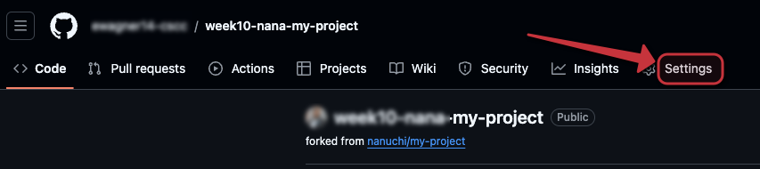
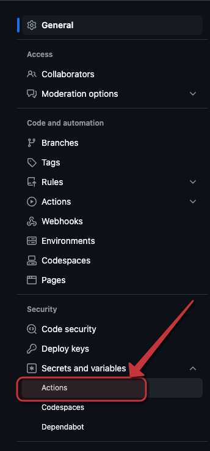
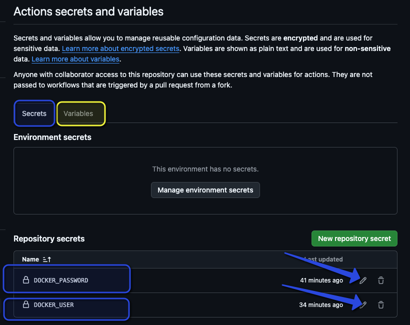

# Week 9/10 lab for WIIT 7501

To work on this lab, we are going to create a new repo by using this template and edit the secrets and variables to allow a push to a Container Registry in Azure.

## Create a new repo from this template.

You all should know how to do this. Do not worry about adding me as a collaborator.

## edit the secrets and variables

Open the settings menu

Scroll down on the left pane, and click the down arrow for the Secrets and Variables section

Update/ add the values in the two menus to be what your instructor says in class

Look at the .github/workflows/ci.yml file for variables and secrets to set.

## Test

Make changes to the README file, or any other file and commit them. They should new images to be built and pushes to the container registry.

## Bonus points

Remind your instructor to set an alarm to delete the registry in a few days to save on Azure credits.

# Thank you [Tech Nana](https://www.techworld-with-nana.com/)

Credit goes to Tech Nana for this quick and easy intro to GitHub Actions. Here is the [Original YouTube Video](https://www.youtube.com/watch?v=R8_veQiYBjI) and the [Original GitHub repo](https://github.com/nanuchi/my-project).